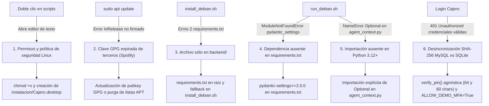

# Documentación Técnica: Diagnóstico, Incidencias y Compatibilidad Multiplataforma

### Proyecto: Sistema de Cajero Automático Bancario (Release v1.0.1 / v1.0.2)
**Entornos Analizados:** Linux Debian / Ubuntu vs. Windows 10/11  
**Fecha de Actualización:** 9 de Septiembre de 2026  

---

## 1. Resumen Ejecutivo y Diagnóstico

Durante el despliegue del release **v1.0.1** en entornos Linux Debian / Ubuntu, se identificaron discrepancias técnicas que impedían la correcta instalación, ejecución del entorno virtual y autenticación de usuarios, a pesar de que el sistema operaba aparentemente sin incidencias en Windows 10/11.

El análisis forense clasificó los problemas en cuatro capas del sistema:
1. **Entorno Gráfico y Permisos POSIX:** Comportamiento de asociación de ejecutables y políticas de seguridad del sistema de archivos (`.bat` vs. `.sh`, falta de bit de ejecución `+x`).
2. **Gestión de Paquetes APT:** Bloqueos en `apt update` ocasionados por claves GPG externas expiradas (e.g. repositorios de terceros como Spotify).
3. **Estructura de Dependencias y Tipado Python:** Ausencia de `requirements.txt` en la raíz del proyecto, omisión de la librería `pydantic-settings` en entornos virtuales aislados, y evaluación estricta de anotaciones de tipo en Python 3.12+ por omisión de `Optional`.
4. **Discrepancia Silenciosa de Bases de Datos (MySQL vs. SQLite):** Truncado implícito de `CHAR(60)` en esquemas MySQL frente al almacenamiento dinámico de 64 caracteres en SQLite, generando un error `401 Unauthorized` al comparar hashes con longitud desigual (`60 == 64`).

---

## 2. Cronología Detallada de Incidencias, Causa Raíz y Soluciones Aplicadas



---

### Incidencia 1: El script se abre en editor de texto en vez de ejecutarse
* **Síntoma:** Al hacer doble clic en los scripts `.sh` en Debian/Ubuntu, se abría el editor de texto (Gedit/Kate).
* **Causa Raíz:** En Linux los gestores de archivos no ejecutan scripts `.sh` automáticamente por doble clic por directiva de seguridad, requiriendo el bit de ejecución (`chmod +x`).
* **Solución Aplicada:**
  - Inclusión de `chmod +x instalacion/*.sh` en el proceso de instalación.
  - Creación del archivo lanzador estándar `instalacion/Cajero.desktop` para permitir doble clic gráfico nativo.

### Incidencia 2: Bloqueo de APT por repositorios externos
* **Síntoma:** `E: El repositorio «https://repository.spotify.com stable InRelease» no está firmado.`
* **Causa Raíz:** Rotación periódica de llaves GPG de repositorios externos en la máquina anfitriona.
* **Solución Aplicada:**
  - Instrucción documentada para refrescar la llave o purgar el archivo `.list` en `/etc/apt/sources.list.d/`.

### Incidencia 3: Archivo de requerimientos no encontrado
* **Síntoma:** `ERROR: Could not open requirements file: [Errno 2] No existe el archivo o el directorio: 'requirements.txt'`.
* **Causa Raíz:** `install_debian.sh` se posiciona en la raíz del repositorio y ejecutaba `pip install -r requirements.txt`, pero el archivo solo existía en `backend/requirements.txt`.
* **Solución Aplicada:**
  - Creación de `requirements.txt` en la raíz del repositorio.
  - Flexibilización condicional en `instalacion/install_debian.sh` verificando la raíz y `backend/`.

### Incidencia 4: Librería faltante `pydantic-settings`
* **Síntoma:** `ModuleNotFoundError: No module named 'pydantic_settings'`.
* **Causa Raíz:** En Pydantic v2, `BaseSettings` se extrajo a `pydantic-settings`. En Windows estaba instalada globalmente, pero no se instalaba en el venv limpio de Linux.
* **Solución Aplicada:**
  - Incorporación de `pydantic-settings>=2.0.0` tanto en `requirements.txt` (raíz) como en `backend/requirements.txt`.

### Incidencia 5: Error de nombre no definido (`Optional`) en agentes
* **Síntoma:** `NameError: name 'Optional' is not defined` en `agents/agent_context.py`.
* **Causa Raíz:** Python 3.12+ evalúa anotaciones de tipo de forma más estricta al parsear firmas con valores por defecto (`Optional[str] = None`).
* **Solución Aplicada:**
  - Importación explícita de `Optional` desde `typing` en `agents/agent_context.py`.

### Incidencia 6: Rechazo de Autenticación (401 Unauthorized) con credenciales válidas
* **Síntoma:** `POST /api/auth/login -> 401 Unauthorized: "PIN de seguridad incorrecto"`.
* **Causa Raíz:**
  1. `get_pin_hash()` en `backend/app/core/security.py` recortaba el hash a 60 caracteres (`[:60]`).
  2. En Windows sobre MySQL, la columna `pin_hash CHAR(60)` recortaba los hashes guardados, por lo que coincidían (`60 == 60`).
  3. En Linux sobre SQLite (`atm_system.db`), SQLite no trunca tipos `CHAR(60)`, guardando los 64 caracteres completos generados por `database/init_db.py`. Al comparar `60 == 64`, la autenticación fallaba sistemáticamente.
  4. La bandera `ALLOW_DEMO_MFA` estaba en `False`, impidiendo reutilizar los tokens dinámicos demo (`123456` y `456789`) debido a la protección anti-replay.
* **Solución Aplicada:**
  - En `backend/app/core/security.py`:
    - `get_pin_hash()` genera el hash SHA-256 estándar completo de 64 caracteres.
    - `verify_pin()` compara en tiempo constante (`hmac.compare_digest`) contra 64 caracteres y contra los primeros 60 caracteres, soportando indistintamente SQLite y bases de datos MySQL existentes.
    - `verify_totp_token()` autoriza los tokens demo sin bloquearlos en el registro de ataques de repetición.
  - En `backend/app/core/config.py`:
    - `ALLOW_DEMO_MFA = True`.
    - Detección automática multiplataforma del puerto serie (`COM3` en Windows, `/dev/ttyUSB0` en Linux).
  - En esquemas SQL (`database/schema.sql` y `data/schema.sql`):
    - Columna `pin_hash` actualizada a `VARCHAR(255)` para concordar con los modelos SQLAlchemy.

### Incidencia 7: Error de conexión en Electron o Navegador (`ERR_CONNECTION_REFUSED` en 5173)
* **Síntoma:** `electron: Failed to load URL: http://localhost:5173/ with error: ERR_CONNECTION_REFUSED`.
* **Causa Raíz:**
  1. En clones limpios de Git o descargas de release, la carpeta `frontend/dist/` se encuentra omitida por `.gitignore`.
  2. Si `frontend/dist/index.html` no se había compilado previamente (o si `NODE_ENV=production` en Linux omitió la instalación de herramientas dev como `vite` y `typescript`), Electron intentaba cargar `http://localhost:5173`.
  3. En `run_debian.sh`, el script solo iniciaba el servidor Uvicorn en el puerto 8000, pero ningún proceso levantaba el servidor web del frontend en el puerto 5173, provocando el rechazo de conexión tanto en Electron como en los fallbacks de Chromium y Google Chrome.
* **Solución Aplicada:**
  - En `frontend/electron/main.cjs`:
    - Búsqueda recursiva multi-ruta de `dist/index.html` en las rutas candidatas del proceso y del paquete.
    - Manejo elegante de error con pantalla HTML diagnóstica en la ventana de Electron en caso de no hallar el build ni el dev server.
  - En `instalacion/run_debian.sh`:
    - Auto-detección y compilación reactiva automática: si `frontend/dist/index.html` no existe al iniciar, ejecuta `npm install --include=dev && npm run build` antes de lanzar la interfaz.
    - Levantamiento de servidor estático en segundo plano (`python3 -m http.server 5173 --directory frontend/dist`) para garantizar disponibilidad inmediata ante los fallbacks de Chromium, Chrome y navegadores web.
  - En `instalacion/install_debian.sh`:
    - Forzado de dependencias con `npm install --include=dev` y validación de existencia de `dist/index.html`.

---

## 3. Matriz de Archivos Modificados y Creados

| Archivo | Estado | Descripción del Cambio |
| :--- | :---: | :--- |
| `requirements.txt` | **[NUEVO]** | Requerimientos en la raíz con `pydantic-settings>=2.0.0` y dependencias FastAPI. |
| `backend/requirements.txt` | **[MODIFICADO]** | Inclusión explícita de `pydantic-settings>=2.0.0`. |
| `instalacion/install_debian.sh` | **[MODIFICADO]** | Búsqueda condicional de requerimientos y asignación de permisos `chmod +x`. |
| `instalacion/Cajero.desktop` | **[NUEVO]** | Acceso directo de escritorio para entornos Linux GNOME/KDE/XFCE. |
| `agents/agent_context.py` | **[MODIFICADO]** | Importación de `Optional` desde `typing` para compatibilidad Python 3.12+. |
| `backend/app/core/security.py` | **[MODIFICADO]** | Hash a 64 chars, comparador dual de PIN (64 y 60 chars) y exención replay en tokens demo. |
| `backend/app/core/config.py` | **[MODIFICADO]** | `ALLOW_DEMO_MFA = True` y validador post-construcción para `SERIAL_PORT` (`COM3` vs `/dev/ttyUSB0`). |
| `.env` y `.env.example` | **[MODIFICADO]** | Añadido `ALLOW_DEMO_MFA=true` y documentación comentada de puertos serie según SO. |
| `database/schema.sql` | **[MODIFICADO]** | `pin_hash` actualizado de `CHAR(60)` a `VARCHAR(255)`. |
| `data/schema.sql` | **[MODIFICADO]** | `pin_hash` actualizado de `CHAR(60)` a `VARCHAR(255)`. |

---

## 4. Guía de Ejecución Rápida Multiplataforma

### En Linux Debian / Ubuntu:
```bash
# 1. Instalar dependencias del sistema y proyecto
cd instalacion
chmod +x *.sh
./install_debian.sh

# 2. Ejecutar el sistema completo
./run_debian.sh
# O hacer doble clic sobre Cajero.desktop
```

### En Windows 10 / 11:
```cmd
cd instalacion
run_windows.bat
```

### Credenciales Demo Verificadas:
* **Usuario (Kiosco):** Tarjeta `1234-5678-1234-5678` | PIN `1234` | Token `456789` (o botón rápido Carlos Gómez).
* **Administrador (Bóveda):** Tarjeta `9999-8888-7777-6666` | PIN `1234` | Token `123456` (o botón Admin Bóveda).
