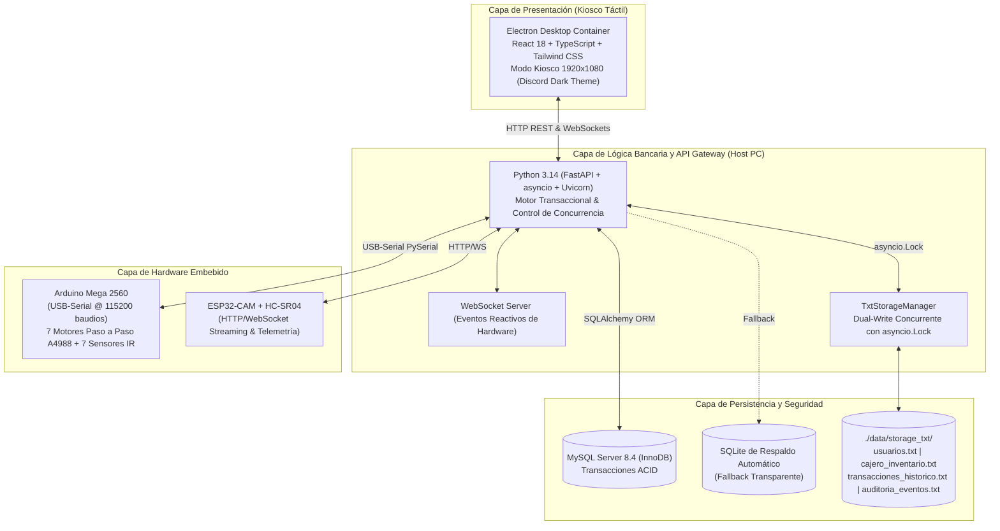

# Manual Técnico de Arquitectura y Hardware Embebido

## Sistema Bancario y Cajero Automático Embebido (ATM Kiosk)

---

### 1. Arquitectura General del Sistema

El sistema opera bajo un modelo de arquitectura distribuida en tres capas principales:



---

### 2. Especificación de Hardware Embebido

Debido a que el microcontrolador ESP32 cuenta únicamente con 520 KB de memoria SRAM interna, la ejecución del motor Chromium y Node.js de la interfaz gráfica reside en la computadora anfitriona (Host Kiosco), mientras que las tareas de tracción de papel moneda y sensado óptico son delegadas jerárquicamente:

#### 2.1 Arduino Mega 2560 (Controlador de Motores y Conteo)
* **Bus de Comunicación:** USB-Serial a 115200 baudios, 8 bits de datos, sin paridad, 1 bit de parada (8N1).
* **Control de Tracción:** Siete (7) drivers A4988 conectados a motores paso a paso NEMA 17 para cada cartucho de billetes:
  * Cartucho Q200: Pin STEP 22, DIR 23
  * Cartucho Q100: Pin STEP 24, DIR 25
  * Cartucho Q50:  Pin STEP 26, DIR 27
  * Cartucho Q20:  Pin STEP 28, DIR 29
  * Cartucho Q10:  Pin STEP 30, DIR 31
  * Cartucho Q5:   Pin STEP 32, DIR 33
  * Cartucho Q1:   Pin STEP 34, DIR 35
  * Habilitación Común (`ENABLE`): Pin 38
* **Sensores Ópticos Infrarrojos de Ranura (IR):**
  * Detectan el borde del billete expulsado por interrupción del haz de luz.
  * Pines de interrupción/lectura: 2, 3, 18, 19, 20, 21, 4.
* **Trama de Comando Enviada desde Backend (Python):**
  ```json
  {"cmd":"DISPENSE","bills":{"200":0,"100":1,"50":0,"20":1,"10":0,"5":0,"1":3}}
  ```
* **Respuesta Exitosa de Arduino:**
  ```json
  {"status":"SUCCESS","dispensed":123}
  ```
* **Respuesta ante Atasco o Bloqueo Óptico:**
  ```json
  {"status":"ERROR","code":"JAM_DETECTED","dispensed":0}
  ```
  *Regla de Seguridad Bancaria:* Ante un atasco mecánico, el backend revierte inmediatamente la transacción sin debitar el saldo del usuario.

#### 2.2 ESP32-CAM (Cámara y Telemetría de Presencia)
* **Sensor de Imagen OV2640:** Captura instantáneas en resolución VGA (640x480) en formato JPEG en el momento de procesar cada retiro o depósito.
* **Sensor Ultrasónico HC-SR04:**
  * Pin Trigger: GPIO 13 | Pin Echo: GPIO 12.
  * Rango de detección: si la distancia es menor a 100 cm, reporta `user_present: true`.
  * Telemetría transmitida vía JSON por endpoint `/status` y eventos WebSockets.

---

### 3. Modelo de Datos Relacional (MySQL InnoDB)

El esquema DDL implementa integridad referencial y transacciones ACID:

```sql
CREATE DATABASE IF NOT EXISTS atm_system CHARACTER SET utf8mb4 COLLATE utf8mb4_unicode_ci;
USE atm_system;

CREATE TABLE roles (
    id_rol INT AUTO_INCREMENT PRIMARY KEY,
    nombre_rol VARCHAR(20) NOT NULL UNIQUE
) ENGINE=InnoDB;

CREATE TABLE usuarios (
    id_usuario INT AUTO_INCREMENT PRIMARY KEY,
    id_rol INT NOT NULL,
    nombre_completo VARCHAR(100) NOT NULL,
    pin_hash VARCHAR(255) NOT NULL,
    token_temporal VARCHAR(10) NULL,
    saldo_actual DECIMAL(12,2) NOT NULL DEFAULT 0.00,
    monto_max_diario DECIMAL(12,2) NOT NULL DEFAULT 2000.00,
    total_retirado_hoy DECIMAL(12,2) NOT NULL DEFAULT 0.00,
    fecha_ultimo_acceso DATETIME NULL,
    cambio_pin_realizado BOOLEAN NOT NULL DEFAULT FALSE,
    activo BOOLEAN NOT NULL DEFAULT TRUE,
    FOREIGN KEY (id_rol) REFERENCES roles(id_rol)
) ENGINE=InnoDB;

CREATE TABLE tarjetas (
    id_tarjeta INT AUTO_INCREMENT PRIMARY KEY,
    id_usuario INT NOT NULL,
    numero_tarjeta CHAR(16) NOT NULL UNIQUE,
    activa BOOLEAN NOT NULL DEFAULT TRUE,
    fecha_emision DATETIME NOT NULL DEFAULT CURRENT_TIMESTAMP,
    FOREIGN KEY (id_usuario) REFERENCES usuarios(id_usuario)
) ENGINE=InnoDB;

CREATE TABLE denominaciones_cajero (
    denominacion INT PRIMARY KEY,
    cantidad_billetes INT NOT NULL DEFAULT 0,
    CHECK (denominacion IN (200, 100, 50, 20, 10, 5, 1))
) ENGINE=InnoDB;

CREATE TABLE arqueos_cajero (
    id_arqueo INT AUTO_INCREMENT PRIMARY KEY,
    tipo_evento ENUM('INICIALIZACION', 'RECARGA') NOT NULL,
    monto_total DECIMAL(12,2) NOT NULL,
    fecha_evento DATETIME NOT NULL DEFAULT CURRENT_TIMESTAMP
) ENGINE=InnoDB;

CREATE TABLE transacciones (
    id_transaccion BIGINT AUTO_INCREMENT PRIMARY KEY,
    id_usuario INT NOT NULL,
    tipo_transaccion ENUM('RETIRO', 'DEPOSITO') NOT NULL,
    monto DECIMAL(12,2) NOT NULL,
    fecha_hora DATETIME NOT NULL DEFAULT CURRENT_TIMESTAMP,
    desglose_billetes JSON NOT NULL,
    FOREIGN KEY (id_usuario) REFERENCES usuarios(id_usuario)
) ENGINE=InnoDB;

CREATE TABLE logs_auditoria (
    id_log BIGINT AUTO_INCREMENT PRIMARY KEY,
    id_usuario INT NULL,
    accion VARCHAR(100) NOT NULL,
    detalles TEXT NULL,
    fecha_hora DATETIME NOT NULL DEFAULT CURRENT_TIMESTAMP
) ENGINE=InnoDB;
```

---

### 4. Persistencia Dual Concurrente en Archivos Planos (.txt)

Cada mutación contable u operativa ejecuta simultáneamente una escritura en MySQL y en `./data/storage_txt/`:

* **`usuarios.txt`**:
  `ID_USUARIO|NOMBRE_COMPLETO|TARJETA_ACTUAL|PIN_HASH|SALDO_ACTUAL|MONTO_MAX_DIARIO|TOTAL_RETIRADO_HOY|CAMBIO_PIN|ULTIMO_ACCESO`
* **`cajero_inventario.txt`**:
  Línea 1: `TOTAL_BOVEDA|{total}`
  Líneas 2..8: `DENOMINACION|CANTIDAD_BILLETES|SUBTOTAL`
* **`transacciones_historico.txt`**:
  `ID_TX|TIMESTAMP|ID_USUARIO|TIPO|MONTO|DESGLOSE_JSON`
* **`auditoria_eventos.txt`**:
  `ID_LOG|TIMESTAMP|ID_USUARIO|ACCION|DETALLES`

El gestor `TxtStorageManager` utiliza un `asyncio.Lock()` para evitar condiciones de carrera (*race conditions*) en escenarios de concurrencia elevada.

---

### 5. Herramientas de Soporte Multiagente (Graphify)

Para habilitar flujos de trabajo colaborativos entre agentes de inteligencia artificial y desarrolladores sin sobrecargar los contextos de token, el sistema integra **Graphify**:

* **Principio de Operación:**
  * Mapea determinísticamente todo el árbol sintáctico abstracto (AST) del repositorio utilizando **Tree-sitter** (sin consumo de tokens LLM).
  * Detecta dependencias funcionales, imports cruzados, herencias y firmas de métodos en Python, TypeScript y JSON.
  * Agrupa el código en comunidades lógicas y conceptuales mediante el algoritmo de particionamiento modular de **Leiden**.

* **Ejecución y Comandos:**
  ```bash
  # Instalación global de la herramienta con uv
  uv tool install graphifyy

  # Extracción determinista de AST en modo sólo código (sin API keys)
  graphify extract . --code-only

  # Agrupación modular en comunidades e informes
  graphify cluster-only .
  ```

* **Artefactos Producidos (`graphify-out/`):**
  * `graphify-out/GRAPH_REPORT.md`: Diagnóstico arquitectónico con identificación de **God Nodes** (`BankingService` con 32 conexiones, `Usuario` con 25 conexiones), comunidades de código y ciclos de importación.
  * `graphify-out/graph.json`: Grafo dirigido serializado (306 nodos, 553 aristas y 27 comunidades) listo para transferirse a agentes de soporte para inyectar únicamente el contexto pertinente, ahorrando hasta un 70% en tokens de prompt.
  * `graphify-out/graph.html`: Visualizador interactivo D3 en navegador del mapa completo del proyecto.
